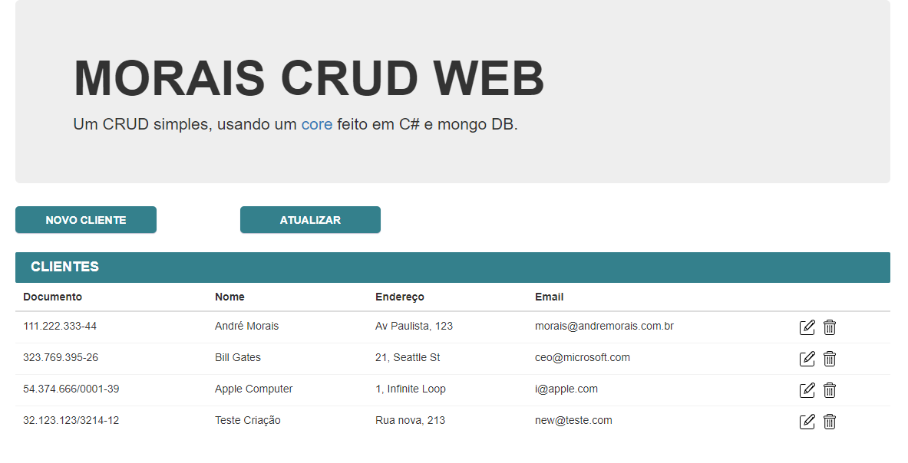
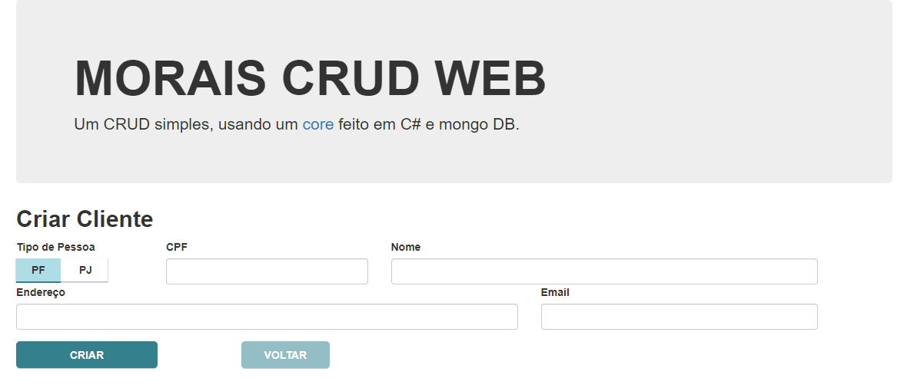
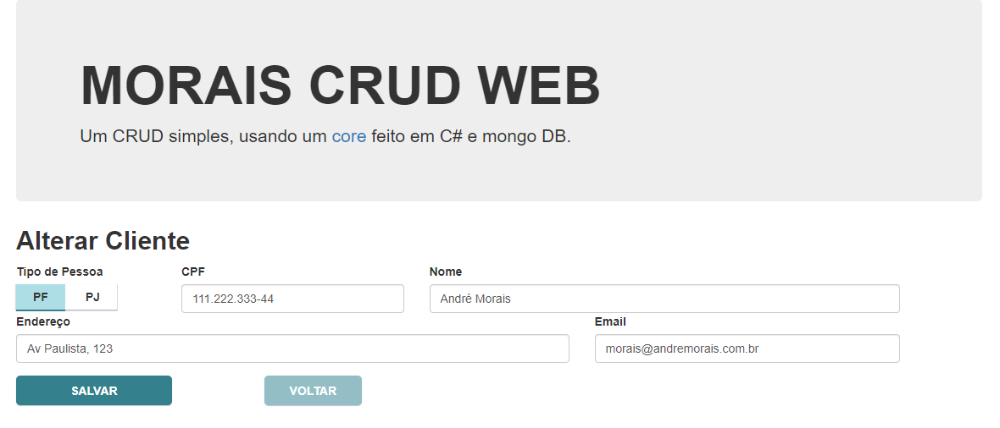

# Morais.CRUD.Web

Um CRUD simples, usando um <a href="https://github.com/moraisandre/Morais.Core">core</a> feito em C# e Mongo DB.

## Imagens
<picture>

 
<label>Página inicial, com a lista de clientes</label>
</picture>
  

<picture>

 
<label>Página para criação de clientes</label>
</picture>
  

<picture>

 
<label>Página para edição dos clientes</label>
</picture>
  
